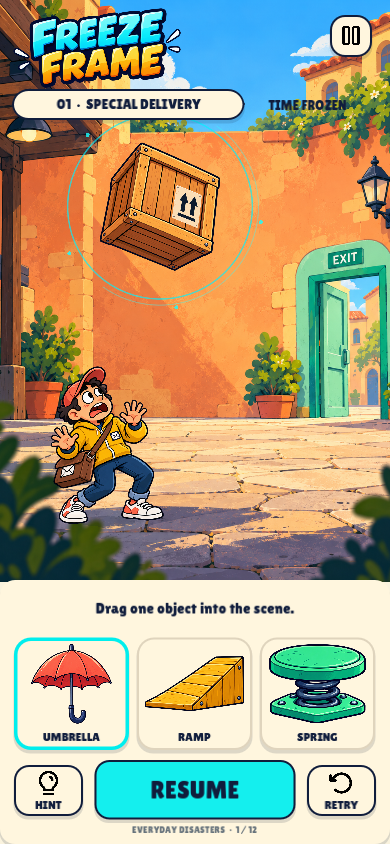

# Freeze Frame

A native portrait Android rescue puzzle game. Freeze a disaster, move one object, and resume to save the courier. Includes 12 levels across courtyard, workshop and rooftop chapters, generated cartoon artwork, local progress, hints, settings, original sound, and vibration on Android.

[Download Android debug APK](https://github.com/Deepak9305/hypercasual/raw/refs/heads/main/build/FreezeFrame-debug.apk) · [Continuation notes](HANDOFF.md)



## Play

- Android: copy `build/FreezeFrame-debug.apk` to a phone and open it to install. This is a debug-signed ARM64 build, requiring Android 7.0 / API 24 or newer. Android may request permission for your file manager to install this app.
- Windows desktop: run `powershell -ExecutionPolicy Bypass -File .\Play.ps1`, or open `project.godot` in Godot 4.7.2 and press F6/F5 to run the game.
- Mouse and touch are supported. Desktop shortcuts: Space for Start / Freeze / Resume, R to retry, H for hints, Escape for pause.

## Controls

Start the scene, then freeze before the hazard reaches the courier. Levels 1–2 freeze automatically. Drag a prop card into the scene, or select a card and place it with a click. Umbrellas can be placed overhead; ramps and springs snap to the floor. An outlined ghost previews placement. Overlaps are rejected and preserve the last placed prop. You may replace your chosen object before resuming; only one prop is active per attempt.

Resume lets the physical scene continue from its frozen velocities. A rescue unlocks the next level. Hints first explain the danger, then reveal the authored solution location. Failed attempts can be retried immediately. Progress and audio/haptic settings are stored locally in Godot's app data folder. There are no accounts, ads, network permissions, or gameplay servers.

## Develop and build

Use Godot 4.7.2 with GDScript and the Compatibility renderer. This machine already has Android templates, the SDK and OpenJDK 17 configured in Godot's editor settings. On another machine, install matching export templates and configure Java SDK / Android SDK paths under Editor Settings > Export > Android. Update the debug keystore path in `export_presets.cfg` to your local Godot debug keystore.

```powershell
powershell -ExecutionPolicy Bypass -File .\Test.ps1
powershell -ExecutionPolicy Bypass -File .\Test.ps1 -Visual
powershell -ExecutionPolicy Bypass -File .\Build-Android.ps1
```

The standard Godot Android export template supplies minimum API 24 and target API 36. The APK package is `com.freezeframe.rescue`, version `0.1.0`. Release signing and store publication are separate from this debug build.

## Project layout

- `scripts/levels.gd` authors 12 `LevelDefinition` resources. Adjust motion, timing, hazards, hints and solution placements here.
- `scripts/world.gd` owns the fixed-step scene, collision rules, freeze state, prop placement and effects. `scripts/actor.gd` supplies physics-driven hazards.
- `scripts/main.gd` owns native menus, touch/mouse input, safe-area fitting, hints and results. `save_data.gd` and `sound.gd` are autoload services.
- `assets/art` contains project-owned raster artwork and generation manifests; `docs` retains all three original visual directions.
- `tools/make_audio.py` regenerates the nine original synthesized WAV files without third-party samples.
- `tests` covers solutions and wrong placements, freeze/retry invariants, touch, pause, persistence, and rendered pointer interaction.
- `build` contains the APK, captured screenshots, test reports and build logs. It is excluded from game resource import.

## Verification and limits

All 12 authored solutions and incorrect-placement cases are exercised through Godot's physics engine. Rendered tests click actual native UI controls, drag a prop, complete a rescue, exercise failure/retry, pause/settings and replay. See `build/test_results.json`, `build/visual_test_results.json`, and `design-qa.md` for final results and evidence.

The latest verified reports are also committed under `docs/verification`: 175 physics/state assertions and 16 rendered interface assertions passed. Desktop rendering measured approximately 60 FPS at a 390×844 window / 780×1688 logical viewport. The rendered test may report a small resource-retention warning at process shutdown; this is recorded for follow-up in `HANDOFF.md`.

The desktop Compatibility/ANGLE renderer is measured separately from Android. No Android device or emulator is connected; installation, real-device safe areas, haptics, audio focus, battery use and Android frame rate remain unverified. This is a playable first build; retention, level difficulty and viral appeal need player testing.

## Assets and licenses

Game illustration, character poses, props, hazards, launcher artwork and logo were generated with the built-in image-generation tool using the selected Cartoon Catastrophe mockup. Each `*_manifest.json` records exact prompts, reference inputs, source image paths, final paths and asset processing. UI labels remain native editable controls.

Lilita One and Bangers fonts are distributed under SIL Open Font License; license files are in `assets/fonts`. Pause, hint and retry icons are unmodified Phosphor Icons assets, under the MIT license in `assets/icons/LICENSE.txt`. Audio was synthesized locally for this project. Godot is distributed under the MIT license; see https://godotengine.org/license/.

