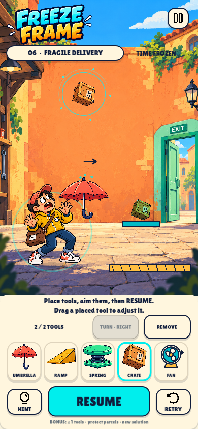

# Freeze Frame

A native portrait Android rescue puzzle game. Freeze a disaster, design a rescue sequence, and set the chain in motion. Version 0.3.0 has four short teaching levels followed by **Wrong Address**, **Fragile Delivery**, **Air Mail**, and **Express Route**.



## Play

- Android: install `build/FreezeFrame-debug.apk`. Debug-signed ARM64 build, Android 7.0 / API 24 or newer, package `com.freezeframe.rescue`, version 0.3.0 (code 3).
- Windows: run `powershell -ExecutionPolicy Bypass -File .\Play.ps1`, or open `project.godot` in Godot 4.7.2 and press F5.
- Desktop shortcuts: Space starts/freezes/resumes; Q turns the selected tool; Delete removes it; R rewinds your plan; H shows hints; Escape pauses.

Start and freeze before the hazard arrives. The four teaching levels freeze automatically; later levels show a FREEZE NOW cue. Drag a tool card into the scene, or select a card and tap a position. Drag an existing tool to move it. TURN changes an umbrella, ramp, or spring between left and right, and aims a fan in eight directions. REMOVE frees a tool slot. Floor tools snap to the path; the other tools preview their placement. Invalid edits leave your plan intact.

Use one of each tool, within the level's tool limit. Umbrellas redirect falling objects; ramps launch rolling objects; springs launch the courier **and objects**; movable crates catch parcels and hold pressure plates; fans push hazards and placed crates. Redirected parcels retain their collisions and can still injure the courier, block the route, or break a fragile bridge. A crate catcher stops and secures a parcel. A raised switch latches its gate open; a pressure plate needs a weight to stay on it. Secured low cargo can be stepped over. The fragile catcher perch breaks under a direct parcel impact, so place a crate on it first. Moving platforms and conveyors are environmental mechanisms.

On failure, **REWIND & ADJUST** restores the same frozen instant with every tool and direction intact. Adjust one thing and retry. A brief inset follows impacts, callouts identify transitions, and a persistent red marker highlights where a chain broke. Hints first describe the sequence, then mark its first intervention.

A successful rescue saves a local motion replay and event timeline. Watch it from results or level select, then try another solution. Optional goals reward a tool count at or below the displayed par, securing every parcel, and completing a different plan. For example, Wrong Address supports both redirecting a parcel onto the raised switch and shielding left while a placed crate holds that switch. Replays store the latest successful rescue per level; they are local playback, not video exports.

The new rescue campaign has a separate save section. Previous campaign progress is retained, settings carry over, and the eight new puzzles start at level one. No accounts, ads, analytics, purchases, network gameplay, or servers are included. Ropes and seesaws are deferred until the five-tool combinations have been playtested.

## Develop and build

Use Godot 4.7.2 and the Compatibility renderer. Android export requires matching templates, Android SDK tools, and Java 17 or later. Configure SDK paths and your local debug keystore in the Godot editor; signing keys remain outside Git.

```powershell
powershell -ExecutionPolicy Bypass -File .\Test.ps1
powershell -ExecutionPolicy Bypass -File .\Test.ps1 -Visual
powershell -ExecutionPolicy Bypass -File .\Build-Android.ps1
```

In this cloud environment, source `/workspace/.cloud-setup/hypercasual/env.sh` first. Rendered tests require the configured Xorg display (`:99`).

```bash
godot --headless --editor --path . --import
godot --headless --path . --scene tests/runner.tscn --fixed-fps 60 -- --test
DISPLAY=:99 godot --path . --resolution 390x844 --audio-driver Dummy --max-fps 60 --scene tests/visual_runner.tscn -- --test
godot --headless --path . --export-debug Android build/FreezeFrame-debug.apk
```

## Project layout

- `scripts/levels.gd` authors the eight puzzles, budgets, solution sequences, and mechanisms; `level_definition.gd` defines their resource format.
- `scripts/world.gd` owns simulation, multi-tool placement, snapshots, gates, feedback and replay playback; `actor.gd` supplies moving hazards and placed crates.
- `scripts/main.gd` owns native controls, touch/mouse input, safe-area fitting, results, and replay screens.
- `scripts/save_data.gd` stores progress, optional goals, plan signatures, and versioned local replay files; `sound.gd` supplies audio/haptics.
- `tests` contains gameplay/state and rendered pointer suites. Current reports are in `docs/verification`; screenshots are in `docs/screenshots`.
- `docs/playtesting.md` describes the next player sessions. `build` contains the debug APK and fresh test output, and is excluded from game imports.

## Verification and limits

Godot tests cover all eight authored solutions, broken chains, nearby placements (±12 logical pixels), alternate tool combinations, spring/crate and fan/crate interactions, redirected parcel damage, closing a gate after removing its weight, retained rewind snapshots, touch ownership, save migration, local replays, and optional goals. Rendered tests exercise real pointer controls through all four chains, turn/remove, failure/rewind/repair, settings, and replay navigation. Both suites release audio cleanly.

The APK is checked for alignment, v2/v3 signatures, version, ARM64, API levels, and permissions (VIBRATE only). No phone or emulator is connected: Android installation, safe areas, audio focus, haptics, battery use, and on-device performance remain unverified. Cloud software rendering is separate from Android performance. Player experimentation and level difficulty still need real playtesting; passing authored solutions does not establish player enjoyment.

A debug APK signed with a different certificate cannot update an older install. Preserve any needed progress before uninstalling that old debug build. Release signing and store publication remain separate work.

## Assets and licenses

The original cartoon art was generated with the built-in image-generation tool; manifests in `assets/art` retain its provenance. The fan is a project-authored SVG; mechanisms, arrows and impact inset are native drawings. Existing Lilita One and Bangers fonts use SIL OFL; Phosphor icons use MIT; synthesized audio has no third-party samples. License files accompany the assets. Godot uses the [MIT license](https://godotengine.org/license/).
